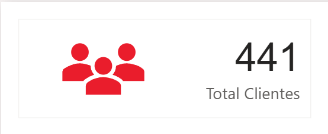
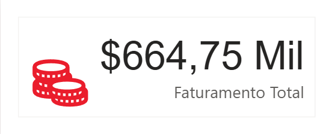
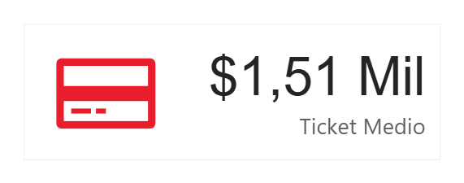
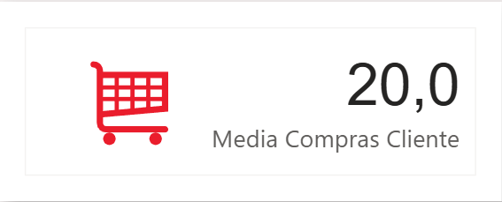
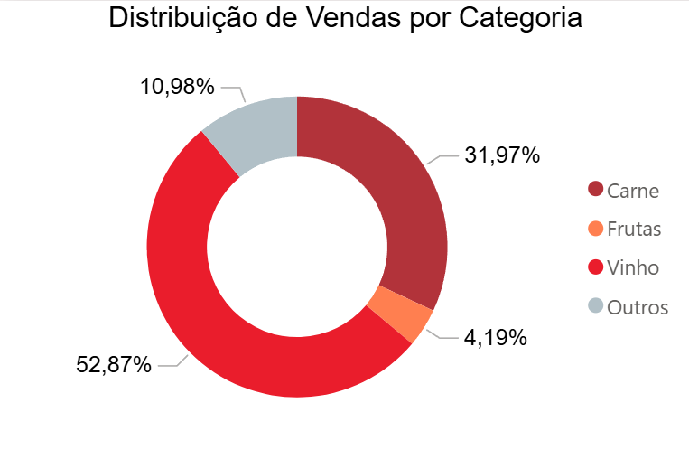
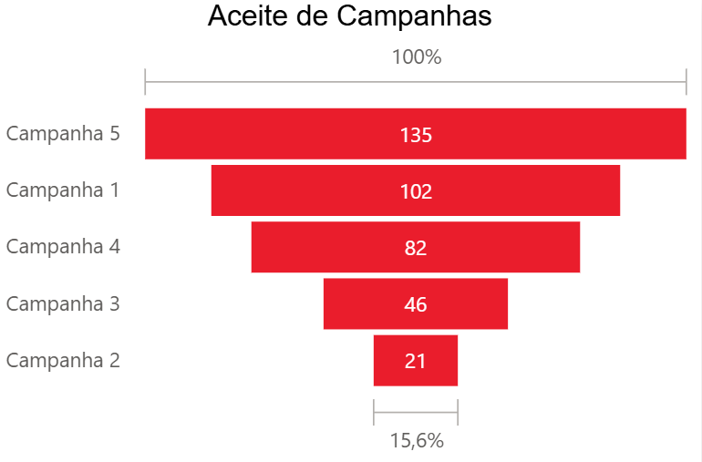
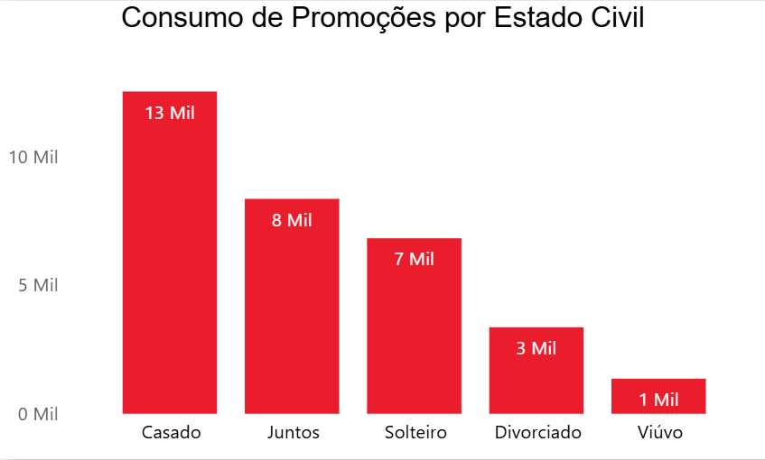
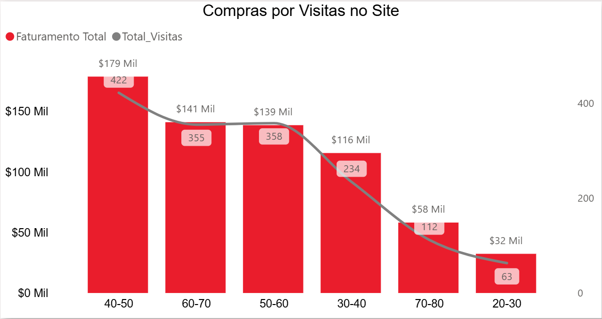

# 📊 Case iFood: Inteligência de Marketing e Estratégia de Dados

Este projeto demonstra o ciclo completo de análise de dados aplicado a um desafio real de marketing do iFood: transformar dados brutos de consumo em decisões estratégicas de negócio.

---

## 🧠 Mentalidade Analítica e Metodologia de Negócio

Antes de iniciar a construção técnica no SQL ou Power BI, este projeto foi fundamentado em uma metodologia focada em **resolução de problemas e geração de valor**:

*   **Diagnóstico e Escuta Ativa:** Compreensão de que uma análise de valor nasce na reunião de alinhamento, identificando as dores da empresa e as perguntas críticas que os dados precisam responder.
*   **Aplicação da Regra de Pareto (80/20):** Foquei a análise nos **20% de clientes (441 registros)** que representam o maior potencial de faturamento e engajamento, permitindo otimizar os recursos de marketing onde o retorno é comprovadamente maior.
*   **Foco em Ação de Marketing:** Cada visualização deste dashboard foi selecionada com um critério rigoroso: **"Isso gera uma ação de marketing?"**. Gráficos que não permitem uma tomada de decisão foram descartados em favor de métricas acionáveis.

### **Os 4 Níveis de Análise Aplicados:**
1.  **Descritiva:** O que aconteceu? (Visão geral de faturamento, ticket médio e base de clientes).
2.  **Diagnóstica:** Por que aconteceu? (Identificação da correlação entre engajamento digital e volume de compras).
3.  **Preditiva:** O que pode acontecer? (Tendências de adesão de campanhas futuras baseadas no histórico de sucesso).
4.  **Prescritiva:** O que devemos fazer? (Sugestões de segmentação e cross-selling para públicos específicos).

---

## 🛠️ Stack Tecnológica e Processos Técnicos

Demonstração de competência técnica em todo o pipeline de dados:

*   **Excel:** Limpeza inicial de dados e engenharia de atributos (criação de faixas etárias e intervalos).
*   **SQL Server:** Modelagem relacional com chaves primárias/estrangeiras (PK/FK), unificação de tabelas via `INNER JOIN` e extração otimizada para performance.
*   **Power Query:** Tratamento de *encoding* (correção de caracteres especiais como 'Viúvo') e normalização de dados.
*   **Power BI (DAX):** Criação de métricas de inteligência de negócio (Ticket Médio real, Frequência de Compra e Faturamento Total).

---

## 📈 Análise Gráfico a Gráfico (Insights e Ações)

Nesta seção, apresento não apenas os dados, mas a inteligência de negócio por trás de cada visualização.

### **1. Monitoramento Dinâmico (Scroller)**

*   **O que analisamos:** Cruzamento de Estado Civil e Faturamento Total.
*   **Visão de Negócio:** Este gráfico comprova que nosso **público-alvo principal são pessoas casadas**. Existe uma lógica sociodemográfica aqui: jovens entre 20 e 30 anos estão em fase de construção de carreira e estudos, com menor poder de consumo. A análise revela que o "existir" financeiro para o consumo de lazer e conveniência amadurece na faixa dos 40-50 anos, onde o faturamento se consolida.

### **2. KPIs de Performance (Cartões)**

*   **Total de Clientes (441):** Representa o "filé" da base. Seguindo a **Regra de Pareto**, focamos nos 20% de clientes que realmente sustentam o faturamento e engajamento da operação.
*   **Faturamento Total (R$ 664,75 Mil):** Um valor expressivo para o recorte analisado, mas que abre espaço para uma **campanha de marketing agressiva**. No ecossistema iFood, onde o consumo de comida é constante, o objetivo é escalar esse valor para a casa dos milhões através da retenção.
*   **Ticket Médio (R$ 1,51 Mil):** Este é um dos insights mais surpreendentes. A média de gasto mensal por cliente é alta, indicando que o público não consome apenas itens baratos, mas investe em produtos de valor agregado.
*   **Média de Compras por Cliente (20 itens):** O cliente não usa o iFood apenas para um item de emergência, mas sim para realizar compras de reposição ou cestas completas (Vinho + Carne + Acompanhamentos).

*   Notei que a campanha de marketing atual ainda não está explorando todo o potencial de "cross-selling" (venda cruzada). Se cada cliente já leva 20 itens, uma estratégia de "Leve 21, Pague 20" ou sugestões inteligentes no checkout podem elevar essa média e, consequentemente, o faturamento total sem precisar adquirir novos clientes.

### **3. Distribuição de Vendas por Categoria (Gráfico de Rosca)**

*   **O que analisamos:** O peso de cada categoria no faturamento total.
*   **Insight de Consumo:** As categorias campeãs são **Vinho e Carne**, impulsionadas principalmente pelos públicos Casados e na faixa de 40-50 anos. 
*   **Comportamento do Consumidor:** Aqui vemos a vitória da **praticidade sobre a logística tradicional**. O cliente que já conhece a qualidade do mercado parceiro não sente mais necessidade de ir presencialmente escolher a carne ou o vinho. Ele confia na marca, busca comodidade e utiliza o iFood como um facilitador de um estilo de vida sofisticado e prático.

### **4. Eficiência de Campanhas (Gráfico de Funil)**

*   **O que analisamos:** Taxa de aceitação das últimas 5 campanhas de marketing.
*   **Insight Estratégico:** A **Campanha 5 foi a campeã absoluta (135 aceites)**. Notei que itens como chocolate e coco, quando atrelados ao vinho, potencializam o lucro. 
*   **Ação Prescritiva:** Proponho a criação de **Combos Estratégicos** (ex: Vinho + Carne + Chocolate ou Queijo). Se utilizarmos a mecânica da Campanha 5 para esses novos combos, a tendência é uma escala imediata no faturamento.

### **5. Consumo de Promoções por Perfil (Gráfico de Barras)**

*   **O que analisamos:** Quem mais aproveita as ofertas (Gold/Promos) de acordo com o Estado Civil.
*   **A Visão Humana dos Dados:** 
    *   **Casados (13 mil em promos):** Representam o maior volume. É o casal que trabalha fora, divide as contas e busca na promoção um alívio para o orçamento doméstico sem abrir mão do prazer de uma boa refeição.
    *   **Viúvos (Menor adesão):** Aqui identificamos uma oportunidade de **Marketing Empático**. Este público muitas vezes consome menos por desmotivação emocional. Campanhas voltadas para o "auto-cuidado" ou porções individuais podem resgatar esse cliente para a base ativa.

### **6. Engajamento Digital vs. Faturamento por Idade**

*   **O que analisamos:** Correlação entre acessos ao site e faturamento real por faixa etária.
*   **A Grande Descoberta:**
    *   **Público 40-50 anos (Ouro):** Tiveram 422 visitas e geraram R$ 178 mil em faturamento. É o público que tem autonomia financeira e utiliza a tecnologia para facilitar a rotina.
    *   **Público 20-30 anos (Inativo):** Apenas 63 acessos e R$ 2 mil em faturamento. A hipótese é que este público, em sua maioria, ainda reside com os pais e não possui a responsabilidade pela compra de alimentos, sendo um público secundário para o iFood neste momento.

---

## 🎯 Conclusão e Próximos Passos
Este projeto comprova que a inteligência de dados permite não apenas ver "o que passou", mas prescrever "o que fazer". Com base nesta análise, as próximas campanhas devem focar no **público maduro (40+)** e na **estruturação de combos de conveniência**, onde a margem de lucro é maior e a barreira de compra é menor.

> 🚀 **[Clique aqui para acessar o Dashboard Interativo Online](https://app.powerbi.com/view?r=eyJrIjoiN2FiMjQzNjAtOTNkOS00Mjg4LWFiOTQtYjU5ODc3MjY4NDQ5IiwidCI6IjM4MTM5OWVhLWM5ZWMtNGZkNC1hYTQ0LWE3MWM1MGI2YzUxNCJ9)**

## 🛠️ Tecnologias e Processos
*   **SQL Server:** Modelagem e unificação de tabelas via `INNER JOIN` (veja o arquivo `query.sql`).
*   **Power Query:** Tratamento de erros de encoding e limpeza de dados.
*   **DAX:** Criação de medidas de inteligência de negócio.

